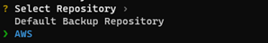

# VBM Job Backup

### Disclaimer

**The VB365 Job configuration backup tool (VJC), aka vbm_rust_backup, is not an official Veeam tool and is, therefore, unsupported. It is provided under the MIT license with no warranty or support implied or provided.**

We take security very seriously, with this in mind please **DO NOT ACCEPT AN EXECUTABLE FROM ANYONE DIRECTLY, ALWAYS BUILD FROM SOURCE.**

We may add an automated publish to this repository at some point, but even then only download from this repository. DO NOT ACCEPT EXECUTABLES SENT DIRECTLY.

### Introduction

The VJC allows users to back up job configurations within Veeam Backup for M365 (VB365). It also allows for the granular restoration of these configurations back into M365 after accidental deletion or when the VB365 server needs to be rebuilt.

It also allows jobs to be moved from one proxy/repository to another, but it will not move the backups from the original location.

For the best experience, it is recommended to use [PowerShell 7](https://learn.microsoft.com/en-us/powershell/scripting/install/installing-powershell?view=powershell-7.3) and [Windows Terminal](https://learn.microsoft.com/en-us/windows/terminal/install).

_Note that the tool does not currently support backup copy jobs_

_The tool has been tested on v5, v6 & v7 but not older versions. Changes to the API between v5 and v6 have been accounted for, so it should work without issue._

### Change Log

| Version | Notes                                                                                                                        |
| ------- | ---------------------------------------------------------------------------------------------------------------------------- |
| 0.1.0   | First beta version                                                                                                           |
| 0.2.0   | Added excluded items support, reduced memory footprint                                                                       |
| 0.3.0   | Added custom creds.json file location via env                                                                                |
| 0.3.1   | Fixed issue with env-pass not being checked                                                                                  |
| 0.3.2   | Updated to use the v7 API by default. Fixed issue with optional values in the schedule object                                |
| 0.3.3   | Same as 0.3.3 added new tag for the github action build                                                                      |
| 0.3.4   | Fixed issue with the getting proxy data on restores due to a different structure being used on the individual proxy response |

### API Calls used

The tool uses standard VB365 API commands, all documented on the help centre. https://helpcenter.veeam.com/docs/vbo365/rest/overview.html?ver=60

Backup

| Endpoint          | Use                                                                |
| ----------------- | ------------------------------------------------------------------ |
| GET Organization  | Used to get the current Organizations                              |
| GET Jobs          | Used to get the jobs                                               |
| GET SelectedItems | Used to get the items associated with the "selectedItems” job type |
| GET ExcludedItems | Used to get the items have been excluded from the job              |

Restore

| Endpoint         | Use                                   |
| ---------------- | ------------------------------------- |
| GET Organization | Used to get the current Organizations |
| GET Jobs         | Used to get the jobs                  |
| GET Proxies      | Used to get the proxies               |
| GET Repositories | Used to get the repositories          |
| POST Jobs        | Used to restore a job                 |

### Installation

The VJC can be run on PC, Mac or Linux.

Steps:

1. clone this repo

```
  git clone https://github.com/shapedthought/vbm_rust_backup.git
```

2. install rust https://www.rust-lang.org/tools/install
3. cd into the vbm_rust_backup directory and run:

```
cargo install --path .
```

This compiles and installs the binary in Rust's own binary directory at $HOME/.cargo/bin, this is will be automatically added to your system path.

To uninstall run:

```
cargo uninstall vbm_rust_backup
```

**It is highly recommended that the tool is not installed/ used on the VB365 server.**

### Docker/Podman installation

To be install in a completely isolated environment you do the following.

1. Install Docker or Podman
2. Download and check the Dockerfile that is included in this repository
3. Run the following in the same directory as the Dockerfile

```
docker build -t vbm_rust_pod .
```

The the dockerfile includes downloading this repository, then building the application in the local image.

To run then do the following:

```
docker run -it --rm vbm_rust_pod bash
```

The --rm flag will delete the container after use.

This will run the container and take you directly into the container command prompt. The application has been installed globally so you can
run it by simply entering:

```
vbm_rust_backup
```

To get the backup configuration files out of the container you can either user a bind mount or you can copy them out using the docker copy command.

For Podman all you need to do is replace "docker" with "podman" for the most part, check the Podman docs for details: https://podman.io/

NOTE: using a bind mount is a potential security concern.

### Creds file

The creds file contains data used to perform the backup and restore.

The creds.json file contains the following parameters:

| Parameter           | Type    | Use                                                           |
| ------------------- | ------- | ------------------------------------------------------------- |
| grant_type:password | String  | Required when logging into the VB365 server with a password   |
| username            | String  | VB365 admin username                                          |
| password            | String  | Encrypted VB365 password                                      |
| url                 | String  | V365 server address                                           |
| port                | Integer | Port used to access the API, default is 4443                  |
| api_version         | String  | The version of the API, default is v7                         |
| insecure            | Boolean | Allows the use of insecure certificates. The default is false |

Normally the the tool needs to be run in the same location as the creds.json file unless you have set a specific location in the environmental variables (VB365_CONFIG):

PowerShell

```
  $env:VB365_CONFIG = "C:\.vb_bu\creds.json"
```

### Backup Password

The saved password is referred to as the **“backup password”**, which is used to encrypt the configuration data.

The **backup password** cannot be used directly to decrypt the configuration data. Also, it cannot decrypt the encrypted backup password as it is encoded and combined with other data before being used.

The reason for doing this is that it allows a non-admin user to use the tool without knowledge of the VB365 password. It also allows for the password to be optionally set as an environmental variable without fear of compromising the VB365 environment.

**When restoring a job configuration to a new VB365 instance, it must use the same VB365 username and password as the server from which the job configuration backup was created.**

### CLI Commands


| Command / Flag         | Description                                                                                                                          |
| ---------------------- | ------------------------------------------------------------------------------------------------------------------------------------ |
| -h/ --help             | Display help information                                                                                                             |
| -c/ --creds            | Starts a wizard to create a creds.json file                                                                                          |
| no flag                | Performs a backup; the creds.json file must be present in the directory where the command is run                                     |
| -r / --restore         | Starts a wizard to restore a job or jobs                                                                                             |
| -e / --env-pass        | If the VB365_PASS environment variable has been set with the backup password, the tool will not ask you to manually enter a password |
| creds-ni               | Creates a creds file non-interactively, aka without the wizard, the flags for this are below                                         |
| -u / --username        | Username                                                                                                                             |
| -a / --address         | VB365 address                                                                                                                        |
| -v / --vb365-password  | The VB365 password                                                                                                                   |
| -b / --backup-password | The backup password                                                                                                                  |
| -p / --port            | Optional, default is 4443                                                                                                            |
| -api-version           | Optional, default is v7                                                                                                              |
| -i / --insecure        | Optional, default is false (secure), enabling allows for invalid certificates e.g. self-signed                                       |

**WARNING using the creds-ni method exposes the VB365 in plain text**

### Usage

#### Creating the creds file - interactive

For more information on the creds file, see the creds file section above.

1. Run the tool with the -c / --creds flag to start the creation wizard
2. Confirm you understand the tool is provided without warranty or support
3. Enter username
4. Enter address
5. Select port, 4443 is default
6. Select API version, v7 is default
7. Enter and confirm the VB365 password
8. Enter and confirm the backup password
9. Select to allow the use of invalid certificates


#### Create the creds file - non-interactive

Run the tool with the creds-ni command and include the following flags

- username
- address
- vb365 password
- backup password
  Optional Flags
- port
- api-version
- insecure


### Run job configuration backup

There are two options

Option 1:

- Run the tool with out any flag
- Enter the backup password
- Complete

Option 2:

- Run the tool with the -e/ --env flag with the VB365_PASS environmental variable set
- Complete

### Display Table

Displays a table with some of the information from the backup file. This aids you in seeing what can be restored.

- Run the tool with the -t/ --table flag
- Enter the password, or use the -e / --env-pass flag if it has been set
- The tool will look for job backup files in the current directory
- Select the job file that you want to view and press enter


### Run Restore

**When restoring a job configuration to a new VB365 instance, it must use the same VB365 username and password as the server from which the job configuration backup was created.**

- Run the tool with the -r / --restore flag
- Enter the backup password if used without the -e / --env-pass flag
- The tool will look for job backup files in the current directory, which you can select
  - If only one job backup file is present, it will ask if you wish to continue
- Select the file required and press enter
- Select the jobs you wish to restore
  - NOTE: if a job name is already in use, it will append the job name with “-restored”


For each job the the tool will ask.

Which Organization to restore to:


Which Proxy to use:


Which Repository to use:



It will the prompt you to restore, once complete it will ask if you wish to run further restores.

Full restore:


### Notes on restores

The tool looks at the current VB365 environment being restored; it does not use the original organization, proxies, or repositories when restoring.

This means that it is incumbent on the user to select the correct Organization to restore to.

As VB365 does not allow for more than one “Entire Organization” backup, if the tool detects that backup type in the jobs currently configured, it will not display or allow restoration of that backup.

See: https://helpcenter.veeam.com/docs/vbo365/guide/select_objects_to_backup.html?ver=60

### Effect on the VB365 Environment

When a job is restored, it effectively creates a new backup job; it isn’t specifically a restore of the original job. Because of this, when you look at the restore points of the new job, it will only show the ones associated with it.

Restores will need to be done at the organizational level to see the entire restore point history for an object.

See: [Exploring Single Organization](https://helpcenter.veeam.com/docs/vbo365/guide/vbo_exploring_single_organization.html?ver=60) for further details.


### Setting Environmental Variables

This assumes you are using PowerShell.

Temporary

    $env:VB365_PASS = “backup_password”

Permanent

System Level:

    [Environment]::SetEnvironmentVariable("VB365_PASS", “backup_password” ,"Machine")

### Troubleshoot

If you have any issues we recommend that you check the logs on the On the VB365 server:
C:\ProgramData\Veeam\Backup365\Logs\Veeam.Archiver.REST_DATE_TIME.log

Example incorrect username:

    [21.11.2022 15:11:47]  176 (4048) Error: The server has rejected the client credentials.
    …
    [21.11.2022 15:11:47]  176 (4048) Error: The logon attempt failed

### Contribution/ Issues

If you find a problem or would like to suggest an improvement please either raise an issue, or send a pull request.
